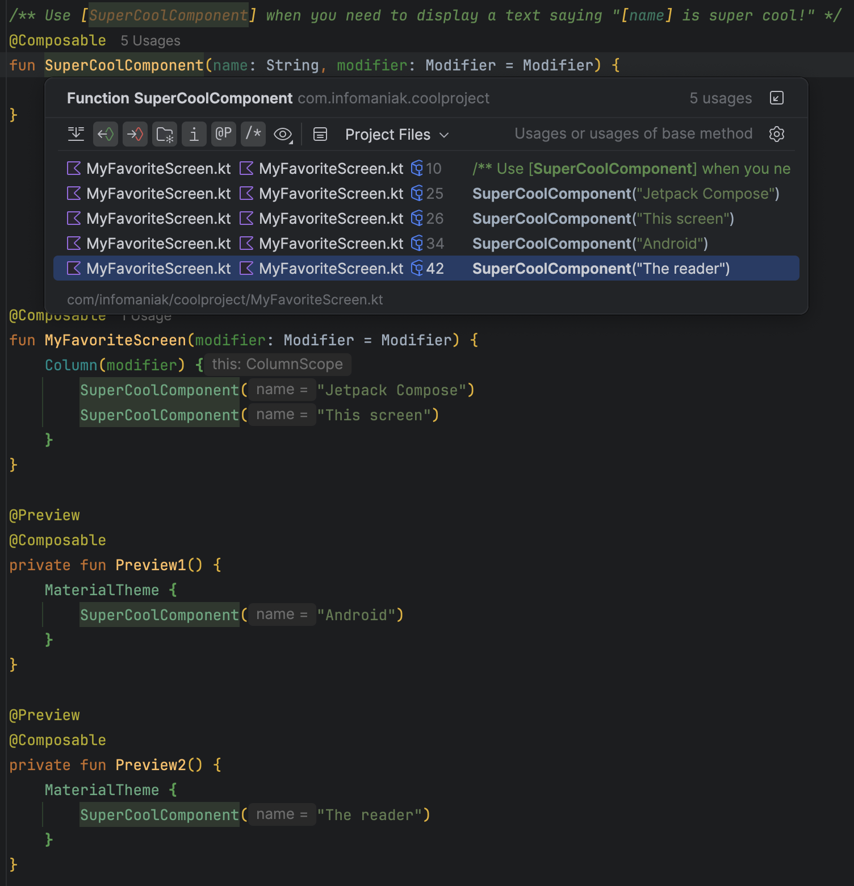
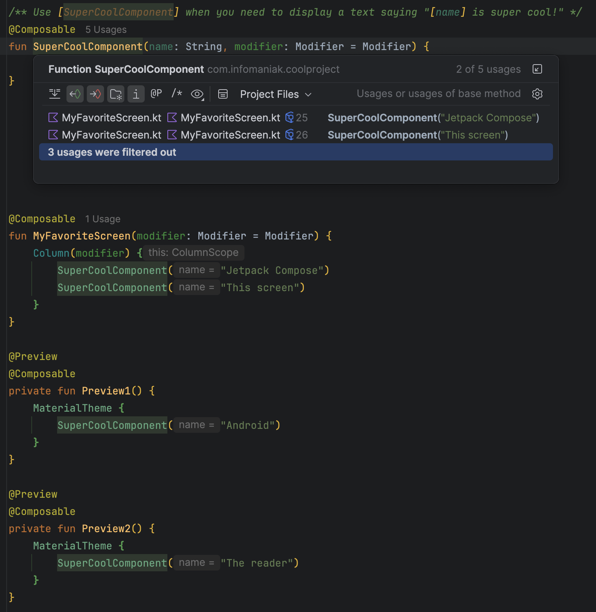

# More Usage Filters

IntelliJ Platform plugin (Android Studio / IntelliJ IDEA) that adds toggles to the usages filter toolbar, next to the
built-in *Show Import Statements* and *Show Generated Code* ones:

| Toggle                   | When it is off, it hides                                                     |
|--------------------------|------------------------------------------------------------------------------|
| **Show Preview Usages**  | every usage located inside a declaration annotated with a preview annotation |
| **Show Comment Usages**  | every usage located inside a comment, KDoc and JavaDoc first and foremost    |

Together they make `Cmd+B` / `Ctrl+B` (and Find Usages) actually useful on a Composable that is, of course, always used
by its own `@Preview` and mentioned in the KDoc of half the file.

## In action

`SuperCoolComponent` has five usages: two real ones in `MyFavoriteScreen`, two that only exist to feed its `@Preview`
functions, and one `[SuperCoolComponent]` link in its own KDoc. Turning both toggles off leaves the two that matter.

| Both toggles on                                             | Both toggles off                                                 |
|-------------------------------------------------------------|------------------------------------------------------------------|
|  |  |

## What is considered a preview

A usage is hidden when one of its enclosing Kotlin declarations (function, class/object or property) carries an
annotation whose short name contains `preview`, case-insensitively:

- `@Preview` (Android Compose and Compose Multiplatform)
- Google multipreview annotations such as `@PreviewScreenSizes`, `@PreviewLightDark`, `@PreviewFontScale`
- your own multipreview annotations, e.g. `@MyAppThemePreviews`

`@PreviewParameter` / `@PreviewParameterProvider` are explicitly excluded, since they do not mark a preview declaration.

The matching is deliberately name based (no resolution, no index access), so it stays fast and works no matter which
preview library is used.

## What is considered a comment

Anything the PSI calls a comment. In practice that means the `[Link]` references of a KDoc, since they are the only
ones `Cmd+B` reports, the other comments only showing up when Find Usages is asked to search in comments and strings.

## Where the toggles show up

The platform builds the filter toolbar from the registered filtering rules, so the toggles appear in:

- the **Find Usages** tool window toolbar (funnel/filter actions)
- the **Show Usages** popup (`Cmd+B` on a declaration), under the filter button

Their state is persisted between sessions like the other usage filters. A keyboard shortcut can be assigned to each of
them in **Settings | Keymap | Other**.

## Building and running

```bash
./gradlew build          # compile, run unit tests and build the plugin distribution
./gradlew runIde         # start a sandbox IDE with the plugin installed
./gradlew verifyPlugin   # run the IntelliJ Plugin Verifier
```

The distribution to share with a zip file is produced by:

```bash
./gradlew buildPlugin
# -> build/distributions/MoreUsageFilters-<version>.zip
```

Install it in Android Studio via **Settings | Plugins | ⚙ | Install Plugin from Disk...**.

## Releasing

`CHANGELOG.md` is the single source of truth for the release notes. The section matching `pluginVersion` is rendered to
HTML by the [gradle-changelog-plugin](https://github.com/JetBrains/gradle-changelog-plugin) and injected as
`<change-notes>` in the generated `plugin.xml`, which is what the Marketplace displays in the update dialog.

To cut a release, add a section named after the new version to `CHANGELOG.md`, bump `pluginVersion` in
`gradle.properties`, then run `./gradlew buildPlugin`.

## Compatibility

Built against IntelliJ IDEA 2026.1 (branch 261) and declared compatible with builds 251 and newer, which covers
Android Studio 2025.1 (Narwhal) and later. The Kotlin plugin is required and is bundled in Android Studio.

## Implementation notes

| File                              | Role                                                                               |
|-----------------------------------|------------------------------------------------------------------------------------|
| `MoreUsageFiltersRuleProvider.kt` | Declares every rule, and the base class that reads the PSI behind a usage.         |
| `PreviewAnnotationMatcher.kt`     | Decides whether an annotation short name marks a preview. Pure logic, unit tested. |
| `PreviewUsageDetector.kt`         | Walks the PSI parents of a usage looking for an annotated declaration.             |
| `CommentUsageDetector.kt`         | Walks the PSI parents of a usage looking for a comment.                            |
| `*UsageFilteringRule.kt`          | One `UsageFilteringRule` per toggle.                                               |
| `META-INF/plugin.xml`             | Registers the extension and the `EmptyAction`s used as the toggle presentations.   |
| `icons/show*Usages*.svg`          | The toolbar icons: `@P` and `/*` traced from JetBrains Mono.                       |
| `META-INF/pluginIcon.svg`         | The plugin icon: a filter funnel with a `+` badge.                                 |

### The icons

The platform's *Show Import Statements* toggle is a serif `i`, echoing the `import` keyword as the editor renders it.
The toggles here follow the same idea one step further: they are literally `@P` and `/*`, set in JetBrains Mono, the
typeface the IDE uses in the editor, so each one echoes the syntax it filters out. The outlines are snapped to the pixel
grid (9px cap height, 1px stem) so they stay crisp at 16x16, and a `_dark` variant is provided for each.

`/**` would be the exact KDoc opener, but it does not survive 16x16: three glyphs at the cap height of the other icons
are 22px wide, and shrinking them to fit turns the asterisks into mush.

The plugin icon steps away from the toolbar glyphs, because it has to stand for the plugin as a whole rather than for
one filter: it is the universal filter funnel with a `+` badge, for "more usage filters". The walls are bowed and every
corner, join and cap is rounded, so it stays soft instead of looking like a cut out triangle. It is hand drawn like the
toolbar icons, so the plugin carries no third party icon licence. The bowl is filled white rather than left hollow, so
the funnel keeps a body on dark themes and echoes the white of the badge, which also means the icon looks the same
whatever the theme and needs no `_dark` variant.
