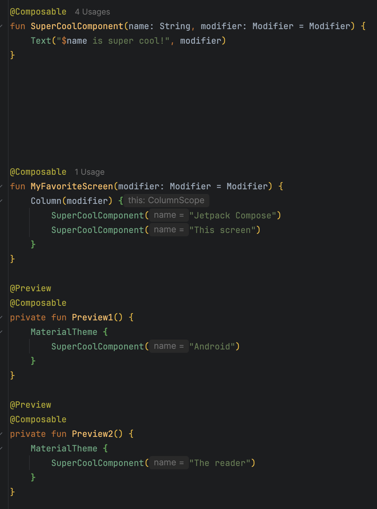
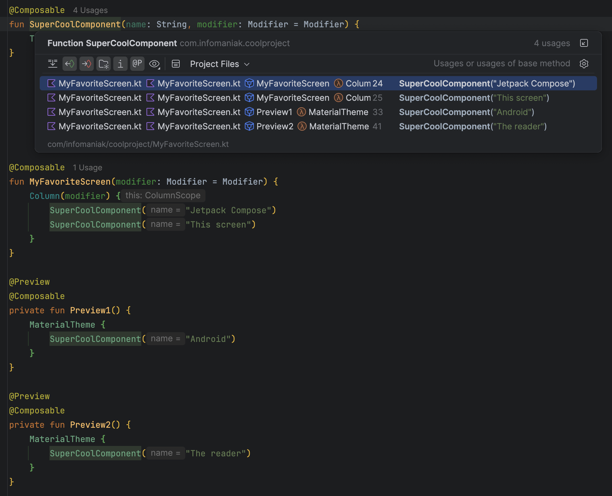
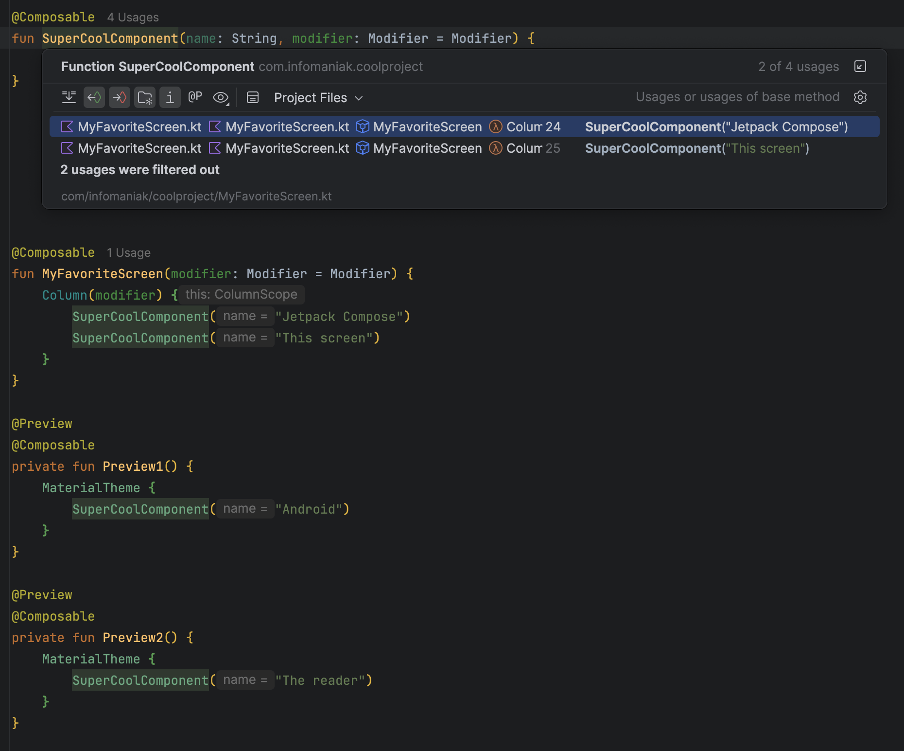

# Filter Out Preview Usages

IntelliJ Platform plugin (Android Studio / IntelliJ IDEA) that adds a **Show Preview Usages** toggle to the usages
filter toolbar, next to the built-in *Show Import Statements* and *Show Generated Code* toggles.

When the toggle is turned off, every usage located inside a declaration annotated with a preview annotation is hidden.
This makes `Cmd+B` / `Ctrl+B` (and Find Usages) actually useful on a Composable that is, of course, always used by its
own `@Preview`.

## In action

`SuperCoolComponent` has four usages: two real ones in `MyFavoriteScreen`, and two that only exist to feed its
`@Preview` functions.



Toggling `Show Preview Usages` off drops the popup from four usages to the two that actually matter:

| Toggle on                                                 | Toggle off                                                        |
|-----------------------------------------------------------|-------------------------------------------------------------------|
|  |  |

## What is considered a preview

A usage is hidden when one of its enclosing Kotlin declarations (function, class/object or property) carries an
annotation whose short name contains `preview`, case-insensitively:

- `@Preview` (Android Compose and Compose Multiplatform)
- Google multipreview annotations such as `@PreviewScreenSizes`, `@PreviewLightDark`, `@PreviewFontScale`
- your own multipreview annotations, e.g. `@MyAppThemePreviews`

`@PreviewParameter` / `@PreviewParameterProvider` are explicitly excluded, since they do not mark a preview declaration.

The matching is deliberately name based (no resolution, no index access), so it stays fast and works no matter which
preview library is used.

## Where the toggle shows up

The platform builds the filter toolbar from the registered filtering rules, so the toggle appears in:

- the **Find Usages** tool window toolbar (funnel/filter actions)
- the **Show Usages** popup (`Cmd+B` on a declaration), under the filter button

Its state is persisted between sessions like the other usage filters. A keyboard shortcut can be assigned in
**Settings | Keymap | Other | Show Preview Usages**.

## Building and running

```bash
./gradlew build          # compile, run unit tests and build the plugin distribution
./gradlew runIde         # start a sandbox IDE with the plugin installed
./gradlew verifyPlugin   # run the IntelliJ Plugin Verifier
```

The distribution to share with a zip file is produced by:

```bash
./gradlew buildPlugin
# -> build/distributions/FilterOutPreviewUsages-<version>.zip
```

Install it in Android Studio via **Settings | Plugins | ⚙ | Install Plugin from Disk...**.

## Releasing

`CHANGELOG.md` is the single source of truth for the release notes. The section matching `pluginVersion` is rendered to
HTML by the [gradle-changelog-plugin](https://github.com/JetBrains/gradle-changelog-plugin) and injected as
`<change-notes>` in the generated `plugin.xml`, which is what the Marketplace displays in the update dialog.

To cut a release, add a section named after the new version to `CHANGELOG.md`, bump `pluginVersion` in
`gradle.properties`, then run `./gradlew buildPlugin`.

## Compatibility

Built against IntelliJ IDEA 2026.1 (branch 261) and declared compatible with builds 251 and newer, which covers
Android Studio 2025.1 (Narwhal) and later. The Kotlin plugin is required and is bundled in Android Studio.

## Implementation notes

| File                           | Role                                                                               |
|--------------------------------|------------------------------------------------------------------------------------|
| `PreviewAnnotationMatcher.kt`  | Decides whether an annotation short name marks a preview. Pure logic, unit tested. |
| `PreviewUsageDetector.kt`      | Walks the PSI parents of a usage looking for an annotated declaration.             |
| `PreviewUsageFilteringRule.kt` | The `UsageFilteringRule` and its `UsageFilteringRuleProvider` extension.           |
| `META-INF/plugin.xml`          | Registers the extension and the `EmptyAction` used as the toggle presentation.     |
| `icons/showPreviewUsages*.svg` | The toolbar icon: `@P` traced from JetBrains Mono.                                 |
| `META-INF/pluginIcon.svg`      | The plugin icon: the same `@P` inside a "forbidden" sign.                          |

### The icon

The platform's *Show Import Statements* toggle is a serif `i`, echoing the `import` keyword as the editor renders it.
The `Show Preview Usages` toggle follows the same idea one step further: it is a literal `@P`, so it echoes the
`@Preview` annotation it filters out. The outlines are snapped to the pixel grid (9px cap height, 1px stem) so they stay
crisp at 16x16, and a `_dark` variant is provided.

The plugin icon reuses the same idea: the `@P` sits inside a prohibition sign (ISO 7010 proportions: a red annulus, a
white field and a 45 degree bar descending to the right), which reads as "no @Preview" at a glance. The bar runs almost
parallel to the stem of the `P`, so drawing it over the glyph swallowed the whole lower stem and left something that
read as a `D`. It is drawn behind the glyph instead, and the glyph carries a thin white halo so it stays crisp where it
crosses the red. The icon carries its own white field, so it reads on light and dark themes alike and needs no `_dark`
variant.
